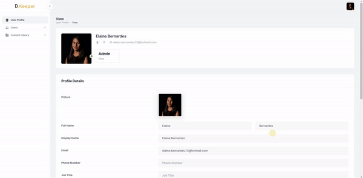
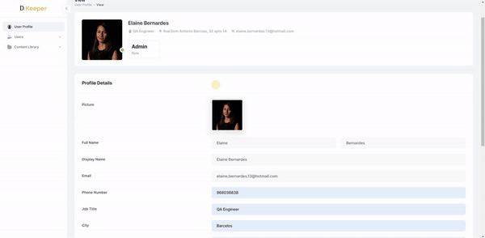

# DiKeeper
{: .no_toc }
A SaaS modular web app to manage users and content (e.g., Revit Families), complemented by a powerful Revit content browser plugin.

## Table of contents
{: .no_toc .text-delta }

1. TOC
{:toc}

---

# User Profile

In the User Profile, the user can manage all their personal information for using DiKeeper. To get started, click on the “Edit Properties” button and activate edit mode for the profile information fields.

## User picture

Click on the pencil icon in the user image to upload an image from your computer. User can also remove the image by clicking on the “Remove Picture” button.

  
Note: the version on the image may not reflect the [latest version of DiKeeper Application](https://diroots.com/custom-software-development/?utm_source=DiKeeper&utm_medium=App-Description&utm_campaign=DiKeeper).

## User information 

All the mandatory fields will already be filled in based on the data entered during user registration. The remaining fields will be available to fill in, such as phone number, job title, country, city, address and zip code.

Once filled in, click on “Save Changes” to save your information.

  
Note: the version on the image may not reflect the [latest version of DiKeeper Application](https://diroots.com/custom-software-development/?utm_source=DiKeeper&utm_medium=App-Description&utm_campaign=DiKeeper).

---

# User Deletion

Make sure you want to delete your account, as once it has been removed, it cannot be recovered. In order to remove it, select the “I confirm my account deletion” checkbox and then click on the “Delete Account” button.

  
Note: the version on the image may not reflect the [latest version of DiKeeper Application](https://diroots.com/custom-software-development/?utm_source=DiKeeper&utm_medium=App-Description&utm_campaign=DiKeeper).